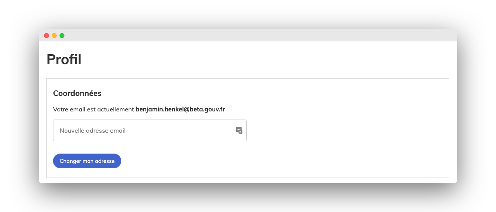

# Pour les administrateurs

###

## Nouveau Type de Champ expérimental : Expression régulière

⚠️ Ce nouveau type de champ est à titre expérimental. La manière dont il est implémenté pourra changer à l'avenir.

Une expression régulière (regex) est une séquence de caractères utilisée pour décrire un ensemble spécifique de chaînes de caractères selon certaines syntaxes. Elle permet d'effectuer des recherches, des remplacements et des validations de données dans une chaîne de caractères.

Dans le cadre de la validation d'un champ de formulaire elle sert à valider les données entrées par un utilisateur en vérifiant si elles correspondent à un certain format. Par exemple, un regex peut vérifier qu'une adresse email entrée dans un champ de formulaire ressemble bien à une adresse email (ex: [nom@example.com](mailto:nom@example.com)) ou à un numéro de téléphone.

Afin d'activer ce type de champ par démarche, veuillez vous rapprocher de notre équipe support avec les numéros de démarches sur lesquelles vous voulez tester.\
\
Une fois que la fonctionnalité est activée, vous pouvez vous rendre dans l'étiteur de champs et choisir un type de champ expression regulière :&#x20;

<figure><figcaption>
Choix du type de champ Expression régulière
</figcaption></figure>

Des informations sont à renseigner :&#x20;

<figure><figcaption></figcaption></figure>

* Saisissez votre expression régulière : vous pouvez la tester sur [https://rubular.com/](https://rubular.com/)
  * Exemple pour valider un code APE : ^\[0-9]{4}\[A-Z]$
    * Explication étape par étape :
      1. `^` et `$` : Ces symboles indiquent le début et la fin de la chaîne, respectivement. Ils s'assurent que tout le texte doit correspondre au modèle.
      2. `[0-9]{4}` : Ceci vérifie que les quatre premiers caractères sont des chiffres de 0 à 9.
      3. `[A-Z]` : Ceci vérifie qu'il y a une lettre majuscule à la fin.
* Saisissez un exemple qui passe votre expression régulière : pour que la démarche soit publiable, l'exemple doit être valide. Sinon il vous sera impossible de publier la démarche.
* Message d'erreur à afficher à l'usager : Il s'agit du message que vous voulez transmettre à l'usager en cas d'erreur de saisie&#x20;

Exemples d'expression régulières que nous testons actuellement :thumbsup:

* je souhaite contraindre la saisie qu'à des chiffres, pas d'espace possible, ni caractère spécial : l'expression régulière à saisir est : "^\d+$" (sans les guillemets)
* je souhaite contraindre la saisie à 9 chiffres pas un de plus ni un de moins, l'expression régulière à saisir est  : "^\d{9}$" (sans les guillemets)

## Changement de couleurs

Afin de permettre aux citoyens d'avoir une cohérence graphique et une meilleure expérience à travers l'ensemble des sites de l'État, le site demarches-simplifiees.fr s'adapte progressivement au Système de Design de l'État.\
\
La première phase d'adaptation de « Démarches simplifiées » se situe au niveau des couleurs et dans les prochains mois d'autres changements seront visibles au niveau des composants et icônes.

## Modification d'une démarche en ligne

Il est désormais possible de modifier une démarche qui a été publiée.

Cette fonctionnalité est désormais activée pour l'ensemble des administrateurs, vous disposez des mêmes options que quand vous créez un formulaire !

### L'ajout d'un champ s'effectue de la même manière que lors d'une création

### Pour republier, il suffit de cliquer sur le bouton « publier les modifications »

La publication des modifications **n'entraîne pas la suppression des dossiers !**

### **Pour les instructeurs, les nouveaux champs et les champs supprimés sont accessibles dans les dossiers et dans les exports.**

**Les dossiers déposés ne sont obligés de modifier leur dossier, seuls les nouveaux dossiers auront les modifications accessibles**

### Recommandations :

Pour les utilisateurs de l'API, il conviendra donc parfois d'adapter l'utilisation de l'API à la nouvelle structure de données.

## Le type de champ « Communes » est disponible&#x20;

Ce champ est connecté à la BAN (Base d'Adresse Nationale) et permet à l'usager de chercher sa commune parmi l'ensemble des communes françaises.&#x20;

## Mettez en forme certains textes de votre démarche grâce à des balises HTML

La description de votre démarche et les descriptions de vos champs peuvent être mises en forme grâce à des balises HTML qui vous permettent de :&#x20;

* mettre votre texte en _italique_
* souligner votre texte
* mettre votre texte en **gras**&#x20;
* faire un paragraphe
* mettre votre texte sous forme de titre.

Retrouvez plus d'informations dans notre aide[ en cliquant ici. ](https://faq.demarches-simplifiees.fr/article/76-puis-je-mettre-en-forme-le-texte-de-ma-demarche)

## La page de description de la démarche change d'interface

Elle a été simplifiée et suit désormais la charte graphique du reste du site.

## Changez l'adresse email associée à votre compte démarches-simplifiées.fr&#x20;

Vous pouvez désormais facilement modifier l'adresse e-mail associée à votre compte démarches-simplifiées.fr. Plus d'informations ici : [https://faq.demarches-simplifiees.fr/article/68-changer-mon-adresse-email](https://faq.demarches-simplifiees.fr/article/68-changer-mon-adresse-email)

## Les administrateurs peuvent proposer à l'usager d'évaluer leurs démarches grâce à « MonAvis »&#x20;

Il est désormais possible de proposer à l'usager d'évaluer votre démarche grâce à [https://monavis.numerique.gouv.fr/](https://monavis.numerique.gouv.fr/), et ce, même si celle-ci est déjà publiée !&#x20;

Plus d'informations ici : [https://doc.demarches-simplifiees.fr/tutoriels/integration-du-bouton-mon-avis](https://doc.demarches-simplifiees.fr/tutoriels/integration-du-bouton-mon-avis)

## Soyez plusieurs administrateurs sur une même démarche&#x20;

Vous pouvez désormais ajouter autant de co-administrateur sur votre démarche que vous voulez !

Plus d'informations ici : [https://faq.demarches-simplifiees.fr/article/52-plusieurs-administrateurs-sur-une-meme-demarche](https://faq.demarches-simplifiees.fr/article/52-plusieurs-administrateurs-sur-une-meme-demarche)


Une présentation de DS pour les acteurs publics


